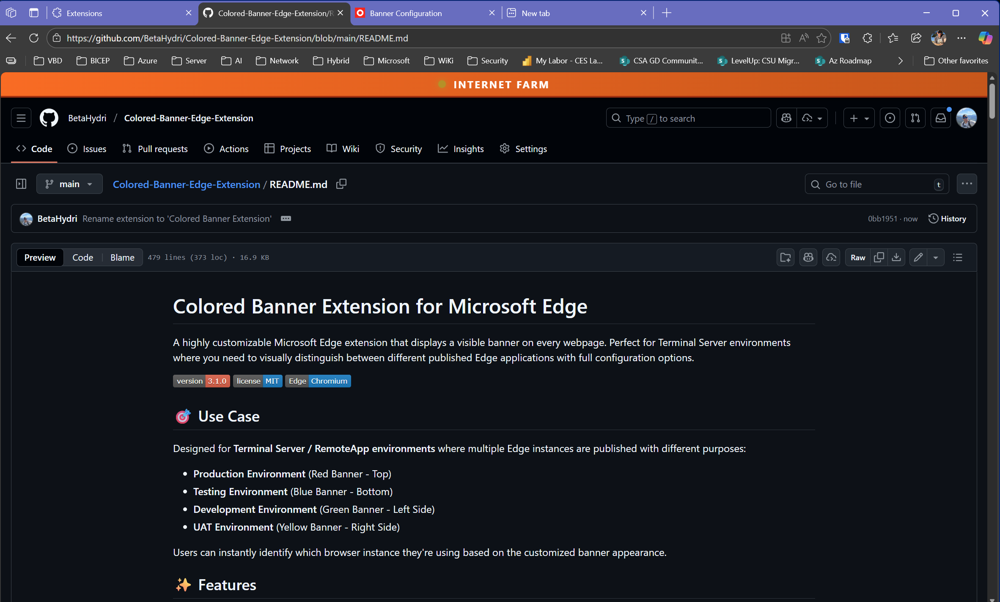
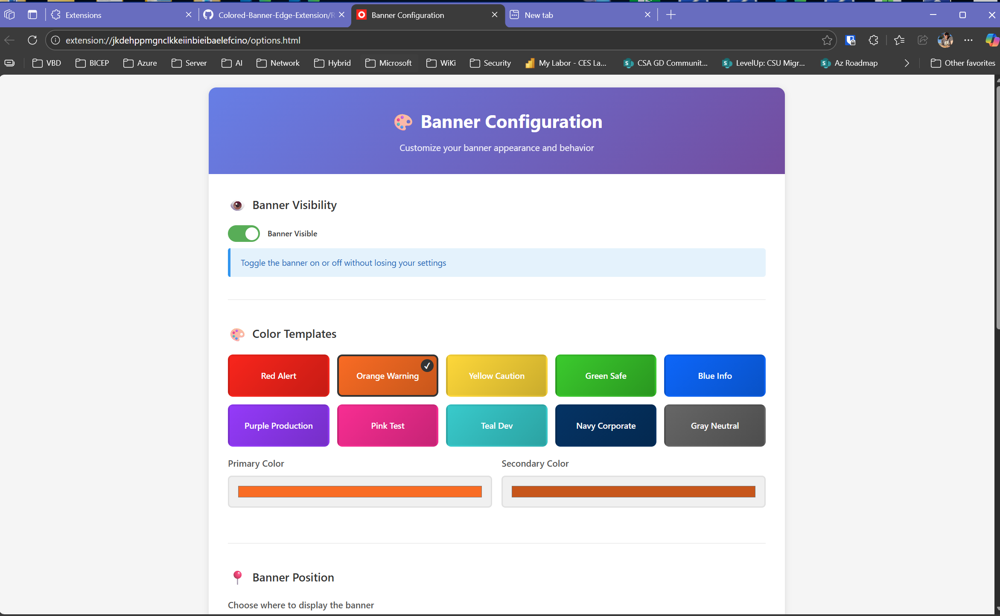
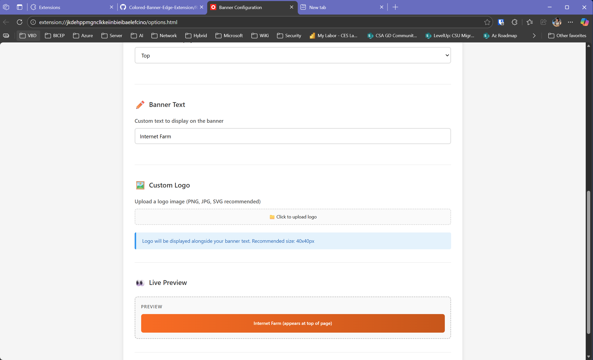

# Colored Banner Extension for Microsoft Edge

A highly customizable Microsoft Edge extension that displays a visible banner on every webpage. Perfect for Terminal Server environments where you need to visually distinguish between different published Edge applications with full configuration options.


**Author:** Jan Tiedemann

## 🎯 Use Case

Designed for **Terminal Server / RemoteApp environments** where multiple Edge instances are published with different purposes:
- **Production Environment** (Red Banner - Top)
- **Testing Environment** (Blue Banner - Bottom)
- **Development Environment** (Green Banner - Left Side)
- **UAT Environment** (Yellow Banner - Right Side)

Users can instantly identify which browser instance they're using based on the customized banner appearance.

## ✨ Features

### Core Features
- ✅ **Automatic Banner Display** - Appears on all websites without user interaction
- ✅ **Customizable Size & Position** - Top, bottom, left, or right side placement
- ✅ **Lightweight** - No background processes, minimal resources
- ✅ **Enterprise-Ready** - Deployable via Group Policy, registry, or file share
- ✅ **Profile-Isolated** - Different Edge profiles maintain separate configurations

### 🎨 NEW: Advanced Customization (v3.1.0)
- ✨ **Multi-Color Templates** - 10 pre-built color schemes (Red, Orange, Yellow, Green, Blue, Purple, Pink, Teal, Navy, Gray)
- ✨ **Configuration UI** - Easy-to-use options page with live preview
- ✨ **Multiple Positions** - Place banner at top, bottom, left side, or right side
- ✨ **Visibility Toggle** - Show/hide banner without losing settings
- ✨ **Custom Logo Support** - Upload your own logo (PNG, JPG, SVG)
- ✨ **Custom Text** - Personalize banner text for each environment
- ✨ **Custom Colors** - Use color picker for unlimited color combinations
- ✨ **Live Preview** - See changes before saving

## 📸 Screenshots

### Banner in Action


*Banner displayed at the top of a webpage with custom colors and text*

### Configuration UI - Color Templates


*Choose from 10 pre-built color templates or create your own*

### Configuration UI - All Options


*Complete configuration interface with position, text, logo, and visibility controls*

## 🚀 Quick Start

### For Development/Testing

1. **Download or clone this repository**
   ```bash
   git clone https://github.com/BetaHydri/Colored-Banner-Edge-Extension.git
   ```

2. **Open Edge and navigate to** `edge://extensions/`

3. **Enable "Developer mode"** (toggle in bottom-left corner)

4. **Click "Load unpacked"** and select the extension folder

5. **Visit any website** - the banner appears automatically!

6. **Customize the banner** - Right-click extension icon → Options to change colors, position, text, and more

## 📦 Installation Methods

### Method 1: Manual Load (Development)

1. Extract extension files to a folder
2. Go to `edge://extensions/`
3. Enable Developer mode
4. Click "Load unpacked"
5. Select the folder

### Method 2: Group Policy Deployment (Domain-Joined Terminal Servers)

**For domain-joined terminal servers only:**

1. Create signed CRX package:
   ```powershell
   .\scripts\create-release.ps1
   ```

2. Deploy to network share and configure Group Policy
   - See **DEPLOYMENT.md** for complete setup instructions

**Note:** Registry deployment does NOT work on unmanaged (non-domain) PCs.

## 🖥️ Terminal Server Setup

### Publishing Multiple Edge Apps with Different Banners

**Scenario:** Publish multiple Edge apps with different banner configurations.

**Example:**
- Production Edge (Red banner at top)
- Testing Edge (Blue banner at bottom)
- Development Edge (Green banner on left)
- Standard Edge (No banner)

#### Step 1: Deploy Extension Files

```powershell
# Run as Administrator
```powershell
.\scripts\deploy-published-app.ps1 -AppName "Internet Farm (Red)" -CreateShortcut
```
```

#### Step 2: Configure Published Apps

**Production Edge App (Red):**
- **Name:** Production Browser
- **Path:** `C:\ProgramData\EdgeExtensions\launch-red-edge.bat`
- **Icon:** `C:\ProgramData\EdgeExtensions\InternetFarm\icons\icon128.png`
- **Banner:** Red template, top position, "PRODUCTION" text

**Testing Edge App (Blue):**
- **Name:** Testing Browser
- **Path:** `C:\ProgramData\EdgeExtensions\launch-blue-edge.bat`
- **Icon:** `C:\ProgramData\EdgeExtensions\InternetFarm\icons\icon128.png`
- **Banner:** Blue template, bottom position, "TESTING" text

**Default Edge App:**
- **Name:** Microsoft Edge
- **Path:** `C:\Program Files (x86)\Microsoft\Edge\Application\msedge.exe`
- **Arguments:** `--profile-directory=Default`
- **Banner:** None

#### Step 3: Configure Each Profile

1. Launch each app once
2. Right-click extension icon → Options
3. Configure color template, position, and text for each
4. Settings are saved per-profile automatically

#### Step 4: Users See Multiple Apps

- **Click "Production Browser"** → Edge opens with red banner at top
- **Click "Testing Browser"** → Edge opens with blue banner at bottom
- **Click "Microsoft Edge"** → Edge opens without banner

Each app uses a separate profile, so configurations are completely isolated.

## 🎨 Customization

### Easy Configuration UI (Recommended)

1. **Open Options Page**
   - Right-click extension icon → Options
   - Or navigate to `edge://extensions/` → Find extension → Details → Extension options

2. **Choose a Color Template**
   - Select from 10 pre-built templates (Red Alert, Orange Warning, Yellow Caution, etc.)
   - Or create custom colors with color picker

3. **Set Banner Position**
   - Top (default)
   - Bottom
   - Left Side (vertical)
   - Right Side (vertical)

4. **Customize Text**
   - Enter custom banner text (e.g., "PRODUCTION", "TESTING", "DEV")

5. **Upload Logo (Optional)**
   - Click "Upload logo" to add custom branding
   - Recommended size: 40x40px
   - Formats: PNG, JPG, SVG (max 100KB)

6. **Toggle Visibility**
   - Hide/show banner without losing your configuration

7. **Preview & Save**
   - View live preview before saving

## 📁 File Structure

<pre>
RedBanner-Extension/
|-- manifest.json                  # Extension configuration (with public key)
|-- content.js                     # Dynamic banner injection script
|-- background.js                  # Background service worker & settings init
|-- options.html                   # Configuration UI (NEW in v3.1.0)
|-- options.js                     # Options page logic (NEW in v3.1.0)
|-- sidepanel.html                 # Side panel UI (optional)
|-- bin/                           # Build outputs (git ignored)
|   |-- RedBanner.crx              # Signed extension package
|   `-- RedBanner.pem              # Private key (NEVER distribute)
|-- icons/                         # Extension icons
|   |-- icon16.png
|   |-- icon32.png
|   |-- icon48.png
|   `-- icon128.png
|-- doc/                           # Screenshots
|   |-- Banner.png
|   |-- BannerConfig1.png
|   `-- BannerConfig2.png
|-- scripts/                       # PowerShell automation scripts
|   |-- create-release.ps1         # Create signed CRX package
|   |-- extract-public-key.ps1     # Extract public key from PEM
|   |-- deploy-registry.ps1        # Deployment script (domain only)
|   |-- deploy-published-app.ps1   # Terminal Server setup
|   |-- launch-red-edge.ps1        # Launch with Red profile
|   |-- launch-default-edge.ps1    # Launch without extension
|   |-- uninstall.ps1              # Removal script
|   `-- update-remote-url.ps1      # Git remote helper
|-- DEPLOYMENT.md                  # Enterprise deployment guide
|-- RELEASE.md                     # Release creation guide (NEW)
|-- TERMINAL-SERVER-SETUP.md       # Terminal Server configuration
|-- MULTI-APP-CONFIGURATION.md     # Multi-app profile setup
`-- README.md                      # This file
</pre>

### Banner Positions

**Top Position (Default)**
<pre>
+----------------------------------+
|  ● PRODUCTION - RED              | <-- Banner
+----------------------------------+
|  Website content                 |
|                                  |
+----------------------------------+
</pre>

**Bottom Position**
<pre>
+----------------------------------+
|  Website content                 |
|                                  |
+----------------------------------+
|  ● TESTING - BLUE                | <-- Banner
+----------------------------------+
</pre>

**Left Side Position**
<pre>
+--+-----------------------------+
| D|                             |
| E|  Website content            |
| V|                             |
| ●|                             |
+--+-----------------------------+
 ^
 Banner
</pre>

**Right Side Position**
<pre>
+-----------------------------+--+
|                             |U |
|  Website content            |A |
|                             |T |
|                             |● |
+-----------------------------+--+
                                ^
                              Banner
</pre>

### Advanced Customization (Manual)

If you prefer to edit code directly, you can modify `content.js` for programmatic customization. However, the Options UI is recommended for most users.

## 📄 Code Documentation

### manifest.json

```json
{
  "manifest_version": 3,
  "name": "Internet Farm",
  "version": "3.1.0",
  "description": "Highly customizable banner for terminal server published Edge applications",
  "key": "MIIBIjANBg...",  // Public key for consistent Extension ID
  "permissions": ["storage"],
  "options_page": "options.html",
  "content_scripts": [{
    "matches": ["<all_urls>"],
    "js": ["content.js"],
    "run_at": "document_start"
  }],
  "background": {
    "service_worker": "background.js"
  },
  "icons": {
    "16": "icons/icon16.png",
    "32": "icons/icon32.png",
    "48": "icons/icon48.png",
    "128": "icons/icon128.png"
  },
  "action": {
    "default_title": "Internet Farm"
  }
}
```

### content.js

Dynamically injects a customizable banner with features:
- Multiple color schemes (from user-configurable settings)
- Multiple positions (top, bottom, left, right)
- Custom text and logo support
- Visibility toggle
- Auto-adjusts body margin to prevent content overlap
- Real-time settings updates via chrome.storage.onChanged
- Blinking green status indicator

### options.html & options.js

Provides a user-friendly configuration interface:
- 10 pre-built color templates
- Custom color picker for unlimited combinations
- Position selector (4 positions: top, bottom, left, right)
- Banner text customization
- Logo upload and preview (PNG, JPG, SVG up to 100KB)
- Visibility toggle
- Live preview panel
- Save/reset functionality
- Settings stored in chrome.storage.local (per-profile)

## 🛠️ PowerShell Scripts

### create-release.ps1 ⭐ NEW
- Creates signed CRX package from source code
- Validates manifest and PEM file
- Creates clean build (excludes dev files)
- Output: `bin\RedBanner.crx`
- **Use this for every release**

### extract-public-key.ps1 ⭐ NEW
- Extracts public key from PEM file
- Adds to manifest.json for consistent Extension ID
- Verifies key matches PEM file

### deploy-registry.ps1
- ⚠️ **Works only on domain-joined servers**
- Copies extension to system location
- Configures registry for force installation
- Requires Administrator privileges

### deploy-published-app.ps1
- Creates batch launchers for Terminal Server
- Generates desktop shortcuts
- Configures RemoteApp settings

### launch-red-edge.ps1 / launch-default-edge.ps1
- Launch Edge with specific profiles
- Useful for testing multi-app setups

### uninstall.ps1
- Removes registry policies
- Deletes local extension files
- Clean uninstallation

### update-remote-url.ps1
- Updates git remote URLs
- Useful for repository maintenance

## 📋 Requirements

- Microsoft Edge (Chromium-based) version 88 or later
- Windows 10/11 or Windows Server 2016+
- For manual installation: Developer mode enabled
- For enterprise deployment: 
  - **Domain-joined machines** (Group Policy deployment)
  - Administrator privileges
  - Network file share for CRX distribution

## 🔒 Security

- ✅ No external network requests
- ✅ No data collection or telemetry
- ✅ Minimal permissions (only "storage")
- ✅ Open source - review the code yourself
### Extension appears in wrong Edge instance

1. Verify using different profiles (`--profile-directory` parameter)
2. Check registry deployment targets correct profile
3. Use separate batch launchers for each app
4. **See MULTI-APP-CONFIGURATION.md for detailed multi-app setup**

### Different published apps share the same banner settings

✅ **This should NOT happen!** Each Edge profile has isolated storage.

**Solution:**
1. Ensure each published app uses a different `--profile-directory`
2. Example: `--profile-directory="InternetFarm-Red"` vs `--profile-directory="InternetFarm-Blue"`
3. Configure each profile separately via the Options page
4. Refer to **MULTI-APP-CONFIGURATION.md** for complete setup guide

### Banner overlaps with website header

1. Change banner position via Options page (try bottom or side positions)
2. Adjust z-index if needed (rare)
3. Some websites with fixed headers may need custom CSS

### Settings not saving

1. Check browser console for errors (F12)
2. Verify storage permissions in manifest.json
3. Try clearing browser cache and reloading extension
4. Check if storage quota is exceeded (unlikely with small settings)
### Extension not auto-installing (Enterprise)

⚠️ **First, verify server is domain-joined:**
```powershell
(Get-WmiObject Win32_ComputerSystem).PartOfDomain  # Should return True
```

**If domain-joined:**
1. Check Group Policy applied: `gpresult /r`
2. View applied policies in Edge: `edge://policy/`
3. Verify network share permissions (READ access)
4. Check Extension ID is correct

**If NOT domain-joined:**
- Registry/Policy deployment won't work
- Use manual installation with Developer mode

### Extension appears in wrong Edge instance

1. Verify using different profiles (`--profile-directory` parameter)
2. Check registry deployment targets correct profile
3. Use separate batch launchers for each app

### Banner overlaps with website header

1. Adjust banner z-index in `content.js`
2. Modify body margin-top value
3. Some websites with fixed headers may need custom CSS

## 🤝 Contributing

Contributions are welcome! Please feel free to submit a Pull Request.

1. Fork the repository
2. Create your feature branch (`git checkout -b feature/AmazingFeature`)
3. Commit your changes (`git commit -m 'Add some AmazingFeature'`)
4. Push to the branch (`git push origin feature/AmazingFeature`)
5. Open a Pull Request
## 🗺️ Roadmap

- [x] Multi-color template generator ✅ v3.1.0
- [x] Configuration UI for easy customization ✅ v3.1.0
- [x] Additional banner positions (bottom, side) ✅ v3.1.0
- [x] Banner hide/show toggle ✅ v3.1.0
- [x] Custom logo support ✅ v3.1.0
- [ ] Banner animation options
- [ ] Export/Import configuration
- [ ] Keyboard shortcut to toggle banner
- [ ] Multiple banner profiles per Edge profile

## 📊 Version History

### v3.1.0 (Current - December 2025)
- ✨ **NEW:** Configuration UI with options page
- ✨ **NEW:** 10 pre-built color templates
- ✨ **NEW:** Multiple banner positions (top, bottom, left, right)
- ✨ **NEW:** Visibility toggle
- ✨ **NEW:** Custom logo upload support
- ✨ **NEW:** Custom text and color picker
- ✨ **NEW:** Live preview functionality
- 🔧 Improved: Profile-isolated storage for multi-app scenarios
- 📚 Documentation: Added MULTI-APP-CONFIGURATION.md

### v3.0.0
- Banner overlay implementation (red default)
- Automatic injection on all pages
- Terminal Server deployment scripts
- Enterprise deployment guides

### v2.1.0
- Side panel implementation
- Auto-open on startup

### v2.0.0
- Initial release
- Basic theme switchingtoggle
- [ ] Custom logo support
- [ ] Banner animation options

## 📊 Version History

### v3.0.0 (Current)
- Red banner overlay implementation
- Automatic injection on all pages
- Terminal Server deployment scripts
- Enterprise deployment guides

### v2.1.0
- Side panel implementation
- Auto-open on startup

### v2.0.0
- Initial release
- Basic theme switching

---

**Author:** Jan Tiedemann

**Made with ❤️ for Terminal Server administrators**

**⭐ If this extension helped you, please give it a star!**
